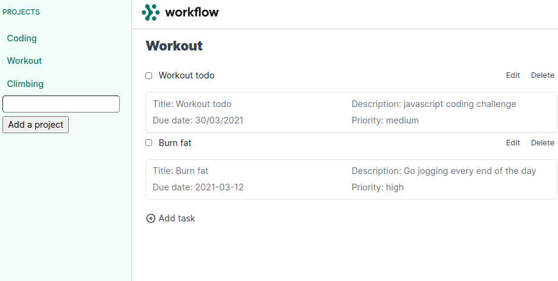

# TO-DO LIST

## Description

Todo list is a simple project or keeping track of your Todo's for different projects. by using this app you can create a new project
and you can add your todos in specific project of your choice.



## Features

A user can:

- Create a new project
- Create a new todo and assign it to the project of his choice
- Can edit an existing todo
- Can delete an existing todo

## Built With

- Javascript
- Webpack
- HTML
- Sass
- active storage

## Getting Started

- Clone this repo
  ```
  git clone git@github.com:abeidahmed/todo-list-js.git
  ```
- Navigate to todo-list-js folder
  ```
  cd todo-list-js
  ```
- On the terminal, while in the 'todo-list-js' directory:

- Run `git checkout feature-todo-v2`

- Run `git pull origin feature-todo-v2`

- Run `yarn install` or ` npm install` to install dependencies

- Run `npm run dev`

- Go to the browser and enter
  `http://127.0.0.1:5500/dist/index.html` and you are now able to visit the app

## Author

👤 **Delice Lydia**

- GitHub: [Delice Lydia](https://github.com/DeliceLydia)
- Twitter: [Delice](https://twitter.com/IngabireLydia3)
- LinkedIn: [Delice Lydia](https://www.linkedin.com/in/delice-lydia/)

👤 **Abeid Ahmed**

- GitHub: [abeidahmed](https://github.com/abeidahmed)
- Twitter: [iamhawaabi](https://twitter.com/iamhawaabi)
- LinkedIn: [Abeid Ahmed](https://www.linkedin.com/in/abeidahmed)

## Contribution

- Clone the repo using the above instructions
- Create a new branch: `git checkout -b awesome branch`
- Add your changes and commit the file
- Push to your forked repo
- Make a pull request to `develop` branch

## Show your support

Give a ⭐️ if you like

## License

This project is [MIT](https://github.com/abeidahmed/todo-list-js/blob/master/LICENSE) licensed.
